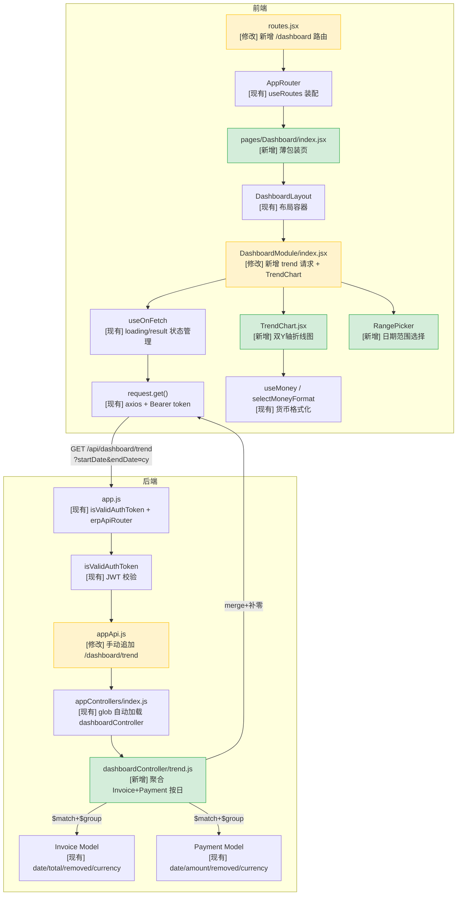
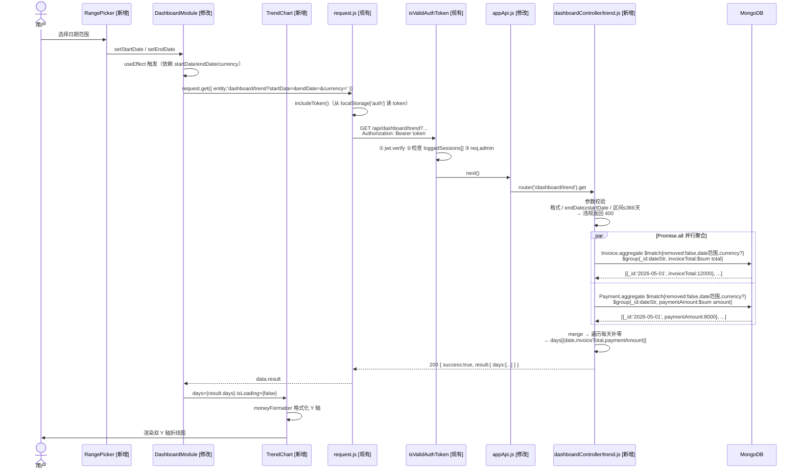
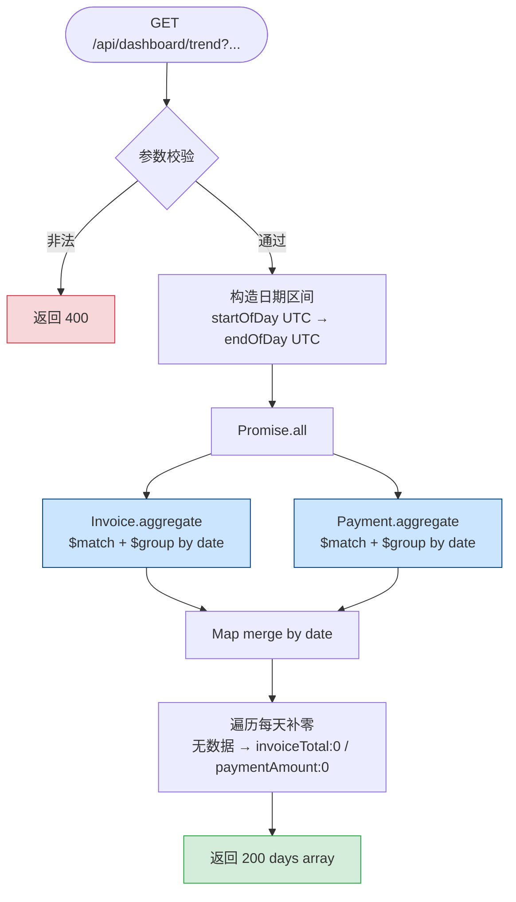

# Dashboard 走势图 — 完整改造方案

> 日期：2026-06-05  
> 状态：待人工审核（第 7 节决策点）

---

## 1. 一句话概要

在 Dashboard 新增一张**双 Y 轴折线图**，左轴展示每日开票总额（Invoice total），右轴展示每日实收金额（Payment amount），共用横轴日期，由用户通过 RangePicker 自选查询区间；后端新增 `GET /api/dashboard/trend` 接口，对 Invoice 和 Payment 集合各做一次按日聚合后合并返回。

---

## 2. 涉及链路

> 绿色 = 新增；黄色 = 需修改；白色 = 现有不动



### 节点说明

**后端**

| 节点 | 文件 | 关键逻辑 | 状态 |
|---|---|---|---|
| B1 HTTP 入口 | `backend/src/app.js:17` | `app.use('/api', adminAuth.isValidAuthToken, erpApiRouter)` | 现有，不动 |
| B2 JWT 校验 | `createAuthMiddleware/isValidAuthToken.js` | jwt.verify → 检查 loggedSessions[] → req.admin | 现有，不动 |
| B3 路由注册 | `routes/appRoutes/appApi.js:26` | routesList.forEach 自动注册；dashboard/trend 不在列表，需手动追加 | **需修改** |
| B4 routesList | `models/utils/index.js` | glob 扫描 appModels/*.js；dashboard 无 Model 文件，不在列表 | 现有，不动 |
| B5 Controller 加载 | `controllers/appControllers/index.js` | glob 扫描 appControllers/**/；dashboardController/ 创建后自动加载 | 现有，不动 |
| B6 Invoice Model | `models/appModels/Invoice.js` | date / total / removed / currency / status | 现有，不动 |
| B7 Payment Model | `models/appModels/Payment.js` | date / amount / removed / currency | 现有，不动 |
| B8 trend Controller | `dashboardController/trend.js` | 参数校验 → Promise.all 并行聚合 → merge → 补零 → 返回 days[] | **新增** |

**前端**

| 节点 | 文件 | 关键逻辑 | 状态 |
|---|---|---|---|
| F1 路由 | `router/routes.jsx` | 新增 /dashboard → Dashboard 页 | **需修改** |
| F2 AppRouter | `router/AppRouter.jsx` | useRoutes 装配，路由表改完自动生效 | 现有，不动 |
| F3 Dashboard 页 | `pages/Dashboard/index.jsx` | DashboardLayout 包裹 DashboardModule | **新增** |
| F4 DashboardLayout | `layout/DashboardLayout/index.jsx` | marginLeft:140 布局容器 | 现有，不动 |
| F5 DashboardModule | `modules/DashboardModule/index.jsx` | 新增 trend 请求 + RangePicker + TrendChart 渲染 | **需修改** |
| F6 request.get() | `request/request.js` | axios.get + Bearer token，无需新增方法 | 现有，不动 |
| F7 useOnFetch | `hooks/useOnFetch.jsx` | 管理 isLoading/result 本地状态 | 现有，不动 |
| F8 TrendChart | `DashboardModule/components/TrendChart.jsx` | recharts ComposedChart，双 Y 轴，moneyFormatter 格式化刻度 | **新增** |
| F9 useMoney | `settings/useMoney.jsx` + `redux/settings/selectors.js` | moneyFormatter + default_currency_code | 现有，不动 |
| F10 RangePicker | DashboardModule 顶部 | antd DatePicker.RangePicker，控制 startDate/endDate state | **新增** |

**⚠️ 关键发现**：`DashboardModule` 当前未挂载到任何路由（`/` 指向 Invoice，不是 Dashboard），本次改造需同步解决路由入口问题。

---

## 3. 改造点清单

### 后端

| 编号 | 类型 | 文件 | 改什么 |
|---|---|---|---|
| P01 | 新增 | `backend/src/controllers/appControllers/dashboardController/trend.js` | 参数校验 → Promise.all 并行聚合 Invoice + Payment（各自 $match{removed:false,date区间,currency?} + $group{_id:dateStr,$sum}）→ Node.js merge → 补零填缺日 → 返回 `{ days:[{date,invoiceTotal,paymentAmount}] }` |
| P02 | 新增 | `backend/src/controllers/appControllers/dashboardController/index.js` | `module.exports = { trend }`，与 invoiceController/index.js 模式一致，被 appControllers/index.js glob 自动加载 |
| P03 | 修改 | `backend/src/routes/appRoutes/appApi.js`（第 26 行） | 追加 `router.route('/dashboard/trend').get(catchErrors(appControllers.dashboardController.trend))` |

### 前端

| 编号 | 类型 | 文件 | 改什么 |
|---|---|---|---|
| P04 | 修改 | `frontend/package.json` | `npm install recharts`（无现有图表库，recharts bundle 更小） |
| P05 | 修改 | `frontend/src/router/routes.jsx`（第 43 行附近） | 新增 `{ path: '/dashboard', element: <Dashboard /> }` + 顶部 lazy import |
| P06 | 修改 | `frontend/src/apps/Navigation/NavigationContainer.jsx`（第 55 行） | `<Link to="/">` 改为 `<Link to="/dashboard">` |
| P07 | 新增 | `frontend/src/pages/Dashboard/index.jsx` | 薄包装：`<DashboardLayout><DashboardModule /></DashboardLayout>` |
| P08 | 修改 | `frontend/src/modules/DashboardModule/index.jsx`（第 38-59、157-193 行） | ① 新增 [startDate,endDate] state；② 新增 useOnFetch 实例；③ useEffect 监听日期+currency 变化调 request.get；④ 插入 RangePicker + TrendChart |
| P09 | 新增 | `frontend/src/modules/DashboardModule/components/TrendChart.jsx` | recharts ComposedChart；props: `{ days, isLoading }`；isLoading 时 Spin；左轴 invoiceTotal，右轴 paymentAmount，横轴日期，Y 轴 moneyFormatter |

### 测试

| 编号 | 类型 | 文件 | 改什么 |
|---|---|---|---|
| P10 | 新增 | `backend/src/__tests__/batch8-dashboard-trend.integration.test.js` | Jest + MongoMemoryServer + supertest；覆盖：正常区间补零 / 400 参数错误 / removed 过滤 / 全空区间返回全零数组 |
| P11 | 新增 | `frontend/src/modules/DashboardModule/components/TrendChart.test.jsx` | Vitest + @testing-library/react；覆盖：isLoading 显 Spin / days 数据正常渲染 / 空 days 不崩溃 |
| P12 | 新增 | `docs/smoke-test-result.md`（追加） | curl 冒烟：登录取 token → GET /api/dashboard/trend?startDate=&endDate= → 验证 days 长度 = 区间天数 |

### 文档

| 编号 | 类型 | 文件 | 改什么 |
|---|---|---|---|
| P13 | 修改 | `docs/api-list.md` | 新增 GET /api/dashboard/trend 接口文档（认证/参数/返回/错误码） |
| P14 | 修改 | `docs/routes-pages.md` | 新增 /dashboard 路由说明 |
| P15 | 修改 | `CLAUDE.md` | DashboardModule 由"未挂路由"改为"已挂路由"；更新关键模块表 |

---

## 4. 改造流程图

### 完整调用链



### 后端 Controller 内部流程



### Schema 变更

**本需求不改任何 Mongoose Schema / MongoDB Collection。**  
仅新增聚合查询，只读 Invoice 的 `date/total/removed/currency` 和 Payment 的 `date/amount/removed/currency`。

---

## 5. 影响范围与风险

### 现有接口

| 接口 | 受影响 | 判断依据 | 风险 |
|---|---|---|---|
| GET /api/invoice/summary | 否 | invoiceController/summary.js 不动 | 低 |
| GET /api/payment/summary | 否 | paymentController/summary.js 不动 | 低 |
| appApi.js 现有所有路由 | 否 | 追加一行不影响现有 routesList.forEach 循环 | 低 |
| appControllers 自动加载 | 间接 | glob 加载新建的 dashboardController/，key 不与已有 controllerName 重名 | 低 |

### 现有调用链路

| 链路 | 受影响 | 判断依据 | 风险 |
|---|---|---|---|
| Invoice / Payment CRUD | 否 | Controller / Model / 路由均不动 | 低 |
| 认证链路 | 否 | auth 相关文件不动 | 低 |
| Dashboard 现有 SummaryCard / PreviewCard | 否 | 新增逻辑，不删改现有 getStatsData 调用 | 低 |
| `/` 根路由 | 否 | 新增 `/dashboard`，`/` 保持指向 Invoice，无影响 | 低 |
| NavigationContainer 高亮 | 轻微 | 链接改为 /dashboard 后 getAppNameByPath 需确认仍正确 | 低 |

### 现有测试

| 测试文件 | 需改动 | 风险 |
|---|---|---|
| batch1 auth-session | 否 | 低 |
| batch2–6 payment/invoice | 否 | 低 |
| batch7 invoice-calc | 否 | 低 |
| 前端测试 | 无现有文件，P11 纯新增 | 低 |

### 文档

| 文档 | 需更新 | 风险 |
|---|---|---|
| docs/api-list.md | 是（P13） | 低 |
| docs/routes-pages.md | 是（P14） | 低 |
| CLAUDE.md | 是（P15） | 低 |
| docs/frontend-state-model.md | 建议更新 | 低 |
| docs/backend-data-model.md / domain-model.md | 否 | — |

### 前端兼容性

| 项目 | 风险 | 说明 |
|---|---|---|
| 新增 recharts | 中 | 无现有图表库；recharts 2.x 支持 React 18 + Vite + ESM，与 antd 5 无冲突；bundle 增加约 300 KB minified / ~100 KB gzip |
| DatePicker.RangePicker | 低 | antd 5.14.1 已内置，dayjs 已在 dependencies |
| Vite 构建 | 低 | recharts 发布 ESM 包，tree-shaking 生效，可单独打包不影响非 Dashboard 页首屏 |

### 性能

| 项目 | 风险 | 说明 |
|---|---|---|
| Invoice/Payment 无 date 索引 | **中** | 两个 Model 均未对 date 字段建索引；366 天查询存在全集合扫描风险，响应可能 > 1s；建议 S03 顺带建索引 |
| Promise.all 并行聚合 | 低 | wall-clock = max(Invoice查询, Payment查询)，比串行快 |
| 366 天上限 | 低（已缓解） | 参数校验拦截超大区间；比现有 summary（全量扫描）反而更收窄 |
| useOnFetch 无请求取消 | 低 | 快速切换日期时末尾请求覆盖 result，后果是显示旧数据而非崩溃；可用 AbortController 优化 |

---

## 6. 改造步骤与顺序

> 工作量：小 < 1h｜中 1–3h｜大 3–6h  
> 🔴 = 需人工决策后才能开始

| 步骤 | 改造点 | 做什么 | 前置依赖 | 工作量 |
|---|---|---|---|---|
| **S01** | — | ~~对齐决策点~~ 全部已确认（见第 7 节）| 无 | — |
| **S02** | P01 | 新建 `dashboardController/trend.js`：参数校验 → Promise.all 并行聚合 → merge → 补零 → 返回 days[] | S01（D3/D4/D5 确认）| 大 |
| **S03** | — | 为 Invoice.date 和 Payment.date 新增 MongoDB 索引（schema 加 `index:true`）| S01 | 小 |
| **S04** | P02 | 新建 `dashboardController/index.js`：`module.exports = { trend }` | S02 | 小 |
| **S05** | P03 | appApi.js 第 26 行追加 `/dashboard/trend` GET 路由 | S04 | 小 |
| **S06** | P10 | 后端测试 `batch8-dashboard-trend.integration.test.js`（Jest + MongoMemoryServer + supertest）| S05 | 中 |
| **S07** | P12 | curl 冒烟验证接口（登录 → 请求 → 验证 days 结构）| S05 | 小 |
| **S08** | P04 | `npm install recharts`（D2 已定）| S01（D2 确认）| 小 |
| **S09** | P07 | 新建 `pages/Dashboard/index.jsx` 薄包装页 | S01（D1 确认）| 小 |
| **S10** | P05 P06 | routes.jsx 新增 /dashboard 路由 + NavigationContainer 改链接 | S09 | 小 |
| **S11** | P09 | 新建 `TrendChart.jsx`：recharts ComposedChart，双 Y 轴，moneyFormatter 刻度 | S08 | 中 |
| **S12** | P08 | 修改 `DashboardModule/index.jsx`：新增 RangePicker state + useOnFetch + TrendChart | S11 | 中 |
| **S13** | P11 | 配置 Vitest + @testing-library/react，写 TrendChart.test.jsx | S11 | 中 |
| **S14** | P13–P15 | 更新 api-list.md / routes-pages.md / CLAUDE.md | S07 S10 | 小 |

**依赖关系**：

```
S01（决策）
  ├─ 后端：S02 → S04 → S05 → S06/S07
  ├─ 后端：S03（可与 S02 并行）
  └─ 前端：S08/S09 → S10
                    S08 → S11 → S12 → S13
S14（收尾，依赖 S07 + S10）
```

---

## 7. 关键决策点（已确认）

| 编号 | 决策问题 | 决策结论 |
|---|---|---|
| D1 | Dashboard 入口路由 | ✅ 新增 `/dashboard`，`/` 保持指向 Invoice |
| D2 | 图表库 | ✅ `recharts` |
| D3 | Invoice 聚合日期字段 | ✅ `Invoice.date` |
| D4 | `currency` 参数缺省行为 | ✅ 缺省聚合所有货币，前端默认传 `default_currency_code` |
| D5 | draft 发票是否计入 invoiceTotal | ✅ 排除 draft |
| D6 | RangePicker 位置 | ✅ DashboardModule 顶部 |
| D7 | 时区处理 | ✅ 前端传 `YYYY-MM-DD` 裸日期，后端解析为 `[startOfDay(UTC), endOfDay(UTC)]` |
